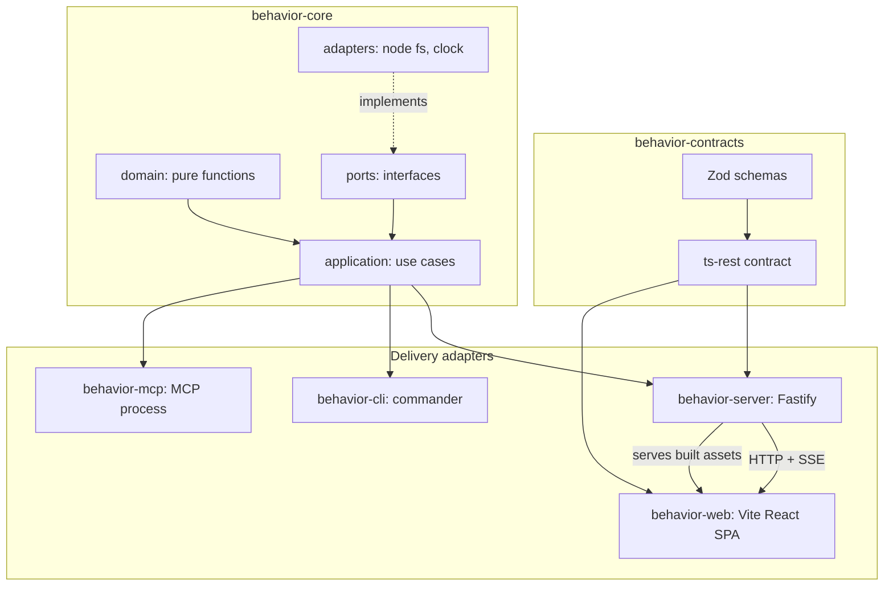

# BeeDeeDee — Behavior Workbench

A local development tool that turns your Gherkin specifications, Mermaid
diagrams, and test results into a browsable map of what your application is
supposed to do, what it currently does, and where the gaps are.

Point it at a project, run one command, and get a catalog of every feature with
its scenarios, linked tests, live pass/fail status, and deep links that open the
spec at the right line in your editor. An MCP server exposes the same picture to
AI agents.

## Quick start

Until [PR #2](https://github.com/danalexilewis/BeeDeeDee/pull/2) lands on
`main`, check out the implementation branch first. On `main` today you still
have the empty Next.js scaffold (`packages/behavior-next`, four workspace
packages, `pnpm@8.0.0`) — that tree will fail with `next: command not found`
and often with `ERR_INVALID_THIS` / `URLSearchParams` against the registry.

```bash
git fetch origin
git checkout cursor/behavior-workbench-implementation-f46d

# Node 22+ and the pinned pnpm (via Corepack)
node -v                    # expect v22.x or newer
corepack enable
corepack prepare pnpm@10.33.3 --activate
pnpm -v                    # expect 10.33.3

pnpm install
pnpm build

# Try it against the bundled demo project
node packages/behavior-cli/dist/cli.js --cwd examples/demo-project serve
```

Then open <http://127.0.0.1:4100>.

If `pnpm install` still reports `ERR_INVALID_THIS` /
`Value of "this" must be of type URLSearchParams`, an older global `pnpm`
(or a shell alias such as `p`) is winning over Corepack. Run
`which pnpm`, drop the stale binary/alias, then re-run
`corepack prepare pnpm@10.33.3 --activate`.

In your own project:

```bash
behavior init     # write a starter .behaviorrc
behavior index    # see what would be indexed, before starting the UI
behavior serve    # open the workbench
```

## What it expects

By default the workbench looks for:

```
specs/features/**/*.feature     Gherkin specifications
specs/diagrams/**/*.mmd         Mermaid diagrams
tests/e2e/**/*.spec.ts          end-to-end tests
tests/components/**/*.spec.ts   component tests
```

Override any of these in `.behaviorrc`. Every field is optional — the file exists
to change defaults, not restate them.

```json
{
  "name": "My Project",
  "specPaths": { "features": "docs/specs", "diagrams": "docs/diagrams" },
  "testPaths": { "e2e": "e2e", "components": "src", "unit": "src" },
  "editorConfig": { "supportedEditors": ["cursor", "vscode"], "openCommand": "cursor" },
  "server": { "port": 4000, "host": "127.0.0.1" }
}
```

A missing config file is fine. A malformed one is an error, because silently
falling back would leave you looking at the wrong directories with no
explanation.

## Commands

| Command                          | What it does                                                |
| -------------------------------- | ----------------------------------------------------------- |
| `behavior init`                  | Write a starter `.behaviorrc`                               |
| `behavior index`                 | Scan and report counts, plus any files that failed to parse |
| `behavior serve`                 | Serve the UI and API from one process                       |
| `behavior ingest-tests <report>` | Update scenario status from a test report                   |
| `behavior lint`                  | Check specs for style and best-practice problems            |
| `behavior validate-links`        | Check every editor deep link resolves to a real file        |
| `behavior export`                | Write the catalog as JSON, CSV, or Markdown                 |

`behavior lint` exits non-zero only for error-severity findings, so warnings can
be surfaced in CI without blocking it. `behavior index` reports files that failed
to parse but still exits zero, since the rest of the index is usable.

### Ingesting test results

```bash
npx playwright test --reporter=json > results.json
behavior ingest-tests results.json --format playwright-json
```

Playwright, Vitest, and Jest JSON reports are understood, as is a `native`
format matching the workbench's own result shape. Re-ingesting the same report
is idempotent.

## Connecting an AI agent

The MCP server runs as its own process. Add it to your agent host's config:

```json
{
  "mcpServers": {
    "behavior-workbench": {
      "command": "npx",
      "args": ["behavior-mcp", "--project", "/path/to/your/project"]
    }
  }
}
```

It offers `describe_project` and `find_features` to orient, then
`get_behavior_context` for a scenario, plus `validate_gherkin`, `suggest_tests`,
`propose_gherkin`, and a `behavior://scenarios/{id}` resource.

**Writes are refused unless you pass `--allow-writes`.** `propose_gherkin`
returns a draft for you to review rather than editing files. Every call is
recorded to stderr with its outcome, including refused writes.

## Architecture



| Package                                             | Responsibility                                                  |
| --------------------------------------------------- | --------------------------------------------------------------- |
| [`behavior-contracts`](packages/behavior-contracts) | Zod schemas and the ts-rest contract — the wire boundary        |
| [`behavior-core`](packages/behavior-core)           | Pure domain logic and use cases over ports                      |
| [`behavior-server`](packages/behavior-server)       | Fastify, the contract router, file watcher, SSE, static serving |
| [`behavior-web`](packages/behavior-web)             | Vite + React SPA                                                |
| [`behavior-cli`](packages/behavior-cli)             | Command-line interface                                          |
| [`behavior-mcp`](packages/behavior-mcp)             | MCP server for AI agents                                        |
| [`test-support`](packages/test-support)             | fast-check arbitraries and fixture builders                     |

The rule that keeps things separable: `domain/` is pure and synchronous,
`application/` orchestrates domain plus ports and is the only home for use cases,
and neither imports Fastify, React, commander, or `node:fs`. Delivery packages
hold no branching business logic — they parse input, call one use case, and map
the result.

See [docs/conventions.md](docs/conventions.md) for the neverthrow, Zod, and
ts-rest conventions, and [docs/decisions.md](docs/decisions.md) for why the
stack looks the way it does.

## Development

Requires Node `>=22` and `pnpm@10.33.3` (see Quick start / Corepack above).

```bash
pnpm install
pnpm build          # tsc project references, then the SPA
pnpm typecheck      # includes test files and the browser package
pnpm test           # unit, property, integration, and component tests
pnpm test:coverage  # with coverage gates
pnpm lint
pnpm format
pnpm e2e            # Playwright against the built SPA served by the built CLI
```

`pnpm e2e` needs Chromium: `pnpm exec playwright install chromium`.

### Testing layers

- **Unit** — colocated `*.test.ts`. Domain functions are pure, so these need no mocking.
- **Property** — `*.prop.test.ts` with fast-check, covering indexing idempotency, ingestion-order independence, coverage monotonicity, status aggregation, and score bounds.
- **Integration** — `fastify.inject()` driven through the real contract client, and CLI tests that spawn the built binary.
- **Component** — Vitest browser mode on Chromium, because this UI renders Mermaid SVG, measures rows for virtual scrolling, and drives panels through `ResizeObserver`; jsdom would need all three mocked.
- **End-to-end** — Playwright against the built SPA served by Fastify.

Coverage gates are 90% for `behavior-core/domain` and 80% overall.

## Licence

MIT. See [LICENSE](LICENSE).
