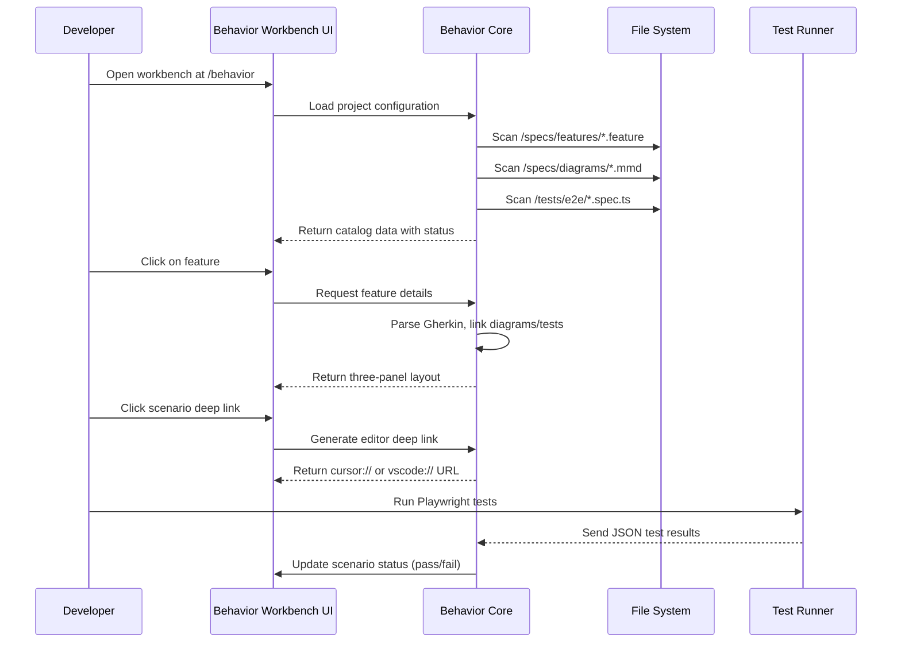
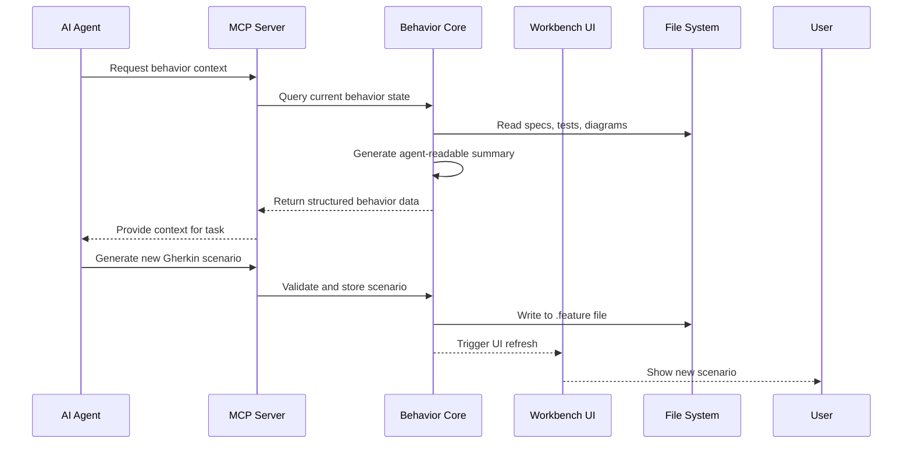

# Design Document: Behavior Workbench

## Overview

The Behavior Workbench is a local development tool that provides a unified interface for understanding, governing, and testing application behavior through AI-assisted workflows. It transforms Gherkin specifications, Mermaid diagrams, and test results into a browsable control plane that visualizes the behavioral map of an application with real-time pass/fail status tracking.

This tool serves as a bridge between specification-driven development and AI-assisted coding, providing developers with a comprehensive view of what their application is supposed to do, how it's currently behaving, and where gaps exist in test coverage. The workbench integrates seamlessly with existing development environments and supports agent-assisted workflows through a local MCP server.

## Architecture

The Behavior Workbench follows a modular, package-based architecture with clear separation between core logic, UI components, and CLI utilities.

```mermaid
graph TB
    subgraph "Core Packages"
        Core[(@eddy/behavior-core<br/>Spec parsing, indexing, analysis)]
        Next[(@eddy/behavior-next<br/>Next.js App Router UI)]
        CLI[(@eddy/behavior-cli<br/>CLI utilities, test ingestion)]
    end
    
    subgraph "External Integrations"
        Playwright[Playwright Test Reports]
        VSCode[VS Code Deep Links]
        Cursor[Cursor Deep Links]
    end
    
    subgraph "Spec Sources"
        Gherkin[Gherkin .feature files]
        Mermaid[Mermaid .mmd files]
        Mappings[Mapping .json files]
    end
    
    subgraph "UI Components"
        Catalog[Catalog View - Dashboard]
        Feature[Feature View - Three-panel layout]
        Scenario[Scenario View - Behavior status]
    end
    
    Core --> Next
    Core --> CLI
    Next --> Catalog
    Next --> Feature
    Next --> Scenario
    CLI --> Playwright
    Gherkin --> Core
    Mermaid --> Core
    Mappings --> Core
    Next --> VSCode
    Next --> Cursor
```

## Sequence Diagrams

### Main User Flow: Browsing Behavior Specifications



### Agent Integration Flow



## Components and Interfaces

### Core Interface: BehaviorCatalog

```typescript
interface BehaviorCatalog {
  // Catalog management
  loadProject(rootPath: string): Promise<ProjectMetadata>;
  scanSpecs(): Promise<FeatureSummary[]>;
  indexTests(): Promise<TestIndex>;
  
  // Feature navigation
  getFeature(featureId: string): Promise<FeatureDetail>;
  getScenario(scenarioId: string): Promise<ScenarioDetail>;
  
  // Test integration
  ingestTestResults(results: TestResult[]): Promise<void>;
  getTestStatus(scenarioId: string): Promise<TestStatus>;
  
  // Agent integration
  generateAgentContext(scenarioId: string): Promise<AgentContext>;
  validateGherkin(gherkin: string): Promise<ValidationResult>;
}
```

### UI Interface: WorkbenchComponents

```typescript
interface WorkbenchComponents {
  // Layout components
  CatalogView: React.ComponentType<CatalogViewProps>;
  FeatureView: React.ComponentType<FeatureViewProps>;
  ScenarioView: React.ComponentType<ScenarioViewProps>;
  
  // Data providers
  useCatalog(): CatalogData;
  useFeature(featureId: string): FeatureData;
  useScenario(scenarioId: string): ScenarioData;
  
  // Integration hooks
  useEditorLinks(): EditorLinkService;
  useTestTelemetry(): TestTelemetryService;
}
```

### CLI Interface: BehaviorCLI

```typescript
interface BehaviorCLI {
  // Command line interface
  startDevServer(options: DevServerOptions): Promise<void>;
  ingestPlaywrightResults(path: string): Promise<void>;
  generateMappings(): Promise<void>;
  
  // Quality checks
  lintSpecs(): Promise<LintResult[]>;
  validateLinks(): Promise<LinkValidationResult[]>;
  
  // Agent utilities
  generateAgentPrompt(context: AgentContext): Promise<string>;
  exportBehaviorData(format: ExportFormat): Promise<string>;
}
```

## Data Models

### Core Data Types

```typescript
interface ProjectMetadata {
  id: string;
  name: string;
  rootPath: string;
  specPaths: {
    features: string;
    diagrams: string;
    mappings?: string;
  };
  testPaths: {
    e2e: string;
    components: string;
    unit?: string;
  };
  editorConfig: EditorConfig;
}

interface FeatureSummary {
  id: string;
  title: string;
  description: string;
  path: string;
  scenarioCount: number;
  testCoverage: number; // 0-100%
  lastUpdated: Date;
  status: 'passing' | 'failing' | 'untested';
}

interface FeatureDetail extends FeatureSummary {
  scenarios: ScenarioSummary[];
  diagrams: DiagramLink[];
  tags: string[];
  background?: GherkinBackground;
  rules?: GherkinRule[];
}

interface ScenarioSummary {
  id: string;
  name: string;
  description: string;
  steps: GherkinStep[];
  tags: string[];
  testLinks: TestLink[];
  diagramLinks: DiagramLink[];
  status: TestStatus;
  lastRun?: Date;
}

interface TestLink {
  type: 'playwright' | 'jest' | 'vitest' | 'custom';
  path: string;
  line: number;
  status: 'pass' | 'fail' | 'skipped' | 'not-run';
  duration?: number;
}

interface DiagramLink {
  type: 'mermaid' | 'plantuml' | 'drawio';
  path: string;
  title: string;
  relevance: 'high' | 'medium' | 'low';
}

interface TestStatus {
  overall: 'pass' | 'fail' | 'skipped' | 'not-run';
  details: TestResultDetail[];
  lastRun: Date;
  flaky: boolean;
}
```

### Editor Integration Types

```typescript
interface EditorConfig {
  supportedEditors: EditorType[];
  deepLinkPatterns: Record<EditorType, string>;
  openCommand: string;
}

type EditorType = 'vscode' | 'cursor' | 'intellij';

interface EditorLink {
  type: EditorType;
  url: string;
  label: string;
  icon: string;
}

interface EditorLinkService {
  generateScenarioLink(scenarioId: string): EditorLink[];
  generateFeatureLink(featureId: string): EditorLink[];
  generateTestLink(testLink: TestLink): EditorLink;
}
```

### Agent Integration Types

```typescript
interface AgentContext {
  scenario: ScenarioDetail;
  relatedScenarios: ScenarioSummary[];
  testResults: TestResultDetail[];
  diagrams: DiagramContent[];
  codeReferences: CodeReference[];
  suggestedActions: AgentAction[];
}

interface AgentAction {
  type: 'generate-test' | 'fix-scenario' | 'add-diagram' | 'improve-coverage';
  description: string;
  priority: 'high' | 'medium' | 'low';
  estimatedEffort: number; // minutes
}

interface CodeReference {
  filePath: string;
  startLine: number;
  endLine: number;
  context: string;
  type: 'implementation' | 'test' | 'config' | 'utility';
}
```

## Algorithmic Pseudocode

### Main Algorithm: Behavior Indexing and Analysis

```pascal
ALGORITHM indexBehaviorSpecs
INPUT: projectRoot of type string
OUTPUT: behaviorIndex of type BehaviorIndex

BEGIN
  ASSERT directoryExists(projectRoot) = true
  
  // Step 1: Initialize index structure
  index ← new BehaviorIndex()
  index.projectRoot ← projectRoot
  
  // Step 2: Scan and parse Gherkin features
  featureFiles ← findFiles(projectRoot + "/specs/features/*.feature")
  
  FOR each file IN featureFiles DO
    INVARIANT: All previously parsed features are valid and indexed
    
    feature ← parseGherkinFile(file)
    
    // Validate feature structure
    ASSERT feature.title ≠ ""
    ASSERT feature.scenarios.length > 0
    
    // Extract scenario IDs and metadata
    FOR each scenario IN feature.scenarios DO
      scenarioId ← generateScenarioId(feature, scenario)
      index.scenarios[scenarioId] ← scenario
      index.featureMap[scenarioId] ← feature.id
    END FOR
    
    index.features[feature.id] ← feature
  END FOR
  
  // Step 3: Scan and link diagrams
  diagramFiles ← findFiles(projectRoot + "/specs/diagrams/*.mmd")
  
  FOR each diagramFile IN diagramFiles DO
    diagram ← parseMermaidFile(diagramFile)
    
    // Match diagrams to scenarios using heuristic matching
    FOR each scenarioId IN index.scenarios.keys() DO
      relevance ← calculateDiagramRelevance(diagram, index.scenarios[scenarioId])
      
      IF relevance ≥ MEDIUM_THRESHOLD THEN
        index.diagramLinks[scenarioId].add({
          diagram: diagram,
          relevance: relevance
        })
      END IF
    END FOR
  END FOR
  
  // Step 4: Scan and link tests
  testFiles ← findFiles(projectRoot + "/tests/**/*.spec.{ts,tsx,js,jsx}")
  
  FOR each testFile IN testFiles DO
    tests ← parseTestFile(testFile)
    
    FOR each test IN tests DO
      // Match tests to scenarios using naming conventions and tags
      scenarioId ← findMatchingScenario(test, index.scenarios)
      
      IF scenarioId ≠ null THEN
        index.testLinks[scenarioId].add({
          test: test,
          file: testFile,
          status: "not-run"
        })
      END IF
    END FOR
  END FOR
  
  // Step 5: Calculate coverage metrics
  FOR each scenarioId IN index.scenarios.keys() DO
    testCount ← index.testLinks[scenarioId].length
    diagramCount ← index.diagramLinks[scenarioId].length
    
    coverage ← calculateCoverage(testCount, diagramCount)
    index.coverage[scenarioId] ← coverage
  END FOR
  
  RETURN index
END
```

**Preconditions:**
- projectRoot points to a valid directory
- Required file patterns exist in the project structure
- Gherkin, Mermaid, and test files are syntactically valid

**Postconditions:**
- behaviorIndex contains all parsed specifications
- All scenarios are linked to their parent features
- Diagrams are linked to relevant scenarios with relevance scores
- Tests are linked to matching scenarios
- Coverage metrics are calculated for each scenario

**Loop Invariants:**
- During feature parsing: All previously parsed features maintain valid structure
- During diagram linking: Relevance scores remain consistent within threshold bounds
- During test linking: Test-to-scenario mappings maintain bidirectional consistency

### Algorithm: Test Result Ingestion and Status Update

```pascal
ALGORITHM ingestTestResults
INPUT: testResults of type TestResult[], behaviorIndex of type BehaviorIndex
OUTPUT: updatedIndex of type BehaviorIndex

BEGIN
  ASSERT testResults ≠ null AND testResults.length > 0
  ASSERT behaviorIndex ≠ null AND behaviorIndex.initialized = true
  
  // Step 1: Group results by test file and scenario
  groupedResults ← groupResultsByScenario(testResults, behaviorIndex)
  
  // Step 2: Update test status for each scenario
  FOR each scenarioId IN groupedResults.keys() DO
    INVARIANT: All previously processed scenarios have consistent status
    
    scenarioResults ← groupedResults[scenarioId]
    
    // Calculate overall status
    IF scenarioResults.length = 0 THEN
      status ← "not-run"
    ELSE IF allPass(scenarioResults) THEN
      status ← "pass"
    ELSE IF anyFail(scenarioResults) THEN
      status ← "fail"
    ELSE
      status ← "skipped"
    END IF
    
    // Update flaky detection
    isFlaky ← detectFlakyBehavior(scenarioResults, behaviorIndex.history[scenarioId])
    
    // Update index
    behaviorIndex.testStatus[scenarioId] ← {
      overall: status,
      details: scenarioResults,
      lastRun: currentTime(),
      flaky: isFlaky
    }
    
    // Update feature status aggregation
    featureId ← behaviorIndex.featureMap[scenarioId]
    updateFeatureStatus(featureId, status, behaviorIndex)
  END FOR
  
  // Step 3: Recalculate coverage metrics
  FOR each featureId IN behaviorIndex.features.keys() DO
    feature ← behaviorIndex.features[featureId]
    testedScenarios ← countTestedScenarios(feature, behaviorIndex)
    
    coverage ← (testedScenarios / feature.scenarios.length) * 100
    behaviorIndex.features[featureId].testCoverage ← coverage
  END FOR
  
  RETURN behaviorIndex
END
```

**Preconditions:**
- testResults array contains valid test result objects
- behaviorIndex is properly initialized with scenario mappings
- Test-to-scenario mappings exist in the index

**Postconditions:**
- All scenario statuses are updated based on test results
- Feature-level status aggregations are recalculated
- Coverage metrics are updated
- Flaky test detection is applied where applicable

**Loop Invariants:**
- During status updates: Feature-scenario relationships remain consistent
- During coverage calculation: Scenario counts remain accurate relative to feature definitions

## Key Functions with Formal Specifications

### Function 1: parseGherkinFile()

```typescript
function parseGherkinFile(filePath: string): ParsedFeature
```

**Preconditions:**
- `filePath` points to an existing file with .feature extension
- File content is valid UTF-8 text
- File follows Gherkin syntax rules

**Postconditions:**
- Returns `ParsedFeature` object with structured data
- Feature has non-empty `title` property
- Scenarios array contains at least one scenario
- All steps have valid keywords (Given, When, Then, And, But)
- Tags are properly extracted and normalized

**Error Conditions:**
- If file doesn't exist → throws `FileNotFoundError`
- If syntax is invalid → throws `GherkinSyntaxError`
- If encoding issues → throws `EncodingError`

### Function 2: calculateDiagramRelevance()

```typescript
function calculateDiagramRelevance(
  diagram: ParsedDiagram, 
  scenario: ScenarioDetail
): RelevanceScore
```

**Preconditions:**
- `diagram` has valid `title` and `content` properties
- `scenario` has valid `name` and `steps` properties
- Both parameters are non-null

**Postconditions:**
- Returns `RelevanceScore` between 0.0 and 1.0
- Score is calculated based on:
  - Title keyword matching
  - Step content overlap
  - Tag correspondence
  - Structural similarity
- Higher scores indicate stronger relevance
- Returns 0.0 if no meaningful connection found

**Invariants:**
- Score calculation is deterministic for same inputs
- Score respects triangle inequality for similarity
- Empty diagram or scenario returns 0.0

### Function 3: generateEditorDeepLink()

```typescript
function generateEditorDeepLink(
  scenarioId: string, 
  editorType: EditorType,
  behaviorIndex: BehaviorIndex
): EditorLink
```

**Preconditions:**
- `scenarioId` exists in `behaviorIndex.scenarios`
- `editorType` is supported in configuration
- `behaviorIndex` contains file path information for the scenario

**Postconditions:**
- Returns valid `EditorLink` object
- Link URL follows editor-specific deep link format
- Link includes line number reference if available
- Link label is human-readable and descriptive
- Link icon matches editor type

**Error Conditions:**
- If scenario not found → throws `ScenarioNotFoundError`
- If editor not supported → throws `EditorNotSupportedError`
- If file path missing → throws `FilePathMissingError`

### Function 4: validateGherkinForAgent()

```typescript
function validateGherkinForAgent(
  gherkinText: string,
  context: ValidationContext
): ValidationResult
```

**Preconditions:**
- `gherkinText` is non-empty string
- `context` contains current project state and patterns
- Project has existing Gherkin specifications for pattern matching

**Postconditions:**
- Returns `ValidationResult` with:
  - `valid`: boolean indicating syntax validity
  - `warnings`: array of style/consistency issues
  - `suggestions`: array of improvement suggestions
  - `compatibility`: score for existing patterns (0-100)
- Validation includes:
  - Syntax checking
  - Style consistency
  - Step pattern matching
  - Tag convention adherence
  - Scenario uniqueness

**Quality Metrics:**
- Returns comprehensive feedback for AI agents
- Suggests improvements based on project conventions
- Detects duplicate or overlapping scenarios

## Example Usage

### Example 1: Setting Up the Workbench

```typescript
// Initialize the behavior workbench in a Next.js project
import { BehaviorWorkbench } from '@eddy/behavior-next';

const workbench = new BehaviorWorkbench({
  projectRoot: process.cwd(),
  specPaths: {
    features: 'specs/features',
    diagrams: 'specs/diagrams',
    mappings: 'specs/mappings'
  },
  testPaths: {
    e2e: 'tests/e2e',
    components: 'tests/components'
  },
  editorConfig: {
    supportedEditors: ['vscode', 'cursor', 'intellij'],
    openCommand: 'code'  // VS Code command
  }
});

// Start the development server
await workbench.startDevServer({
  port: 3001,
  openBrowser: true
});

// Index all behavior specifications
const catalog = await workbench.scanSpecs();
console.log(`Found ${catalog.features.length} features with ${catalog.totalScenarios} scenarios`);
```

### Example 2: Integrating with Test Runner

```typescript
// After running Playwright tests, ingest results
import { BehaviorCLI } from '@eddy/behavior-cli';

const cli = new BehaviorCLI(process.cwd());

// Ingest Playwright JSON report
await cli.ingestPlaywrightResults('./playwright-report/results.json');

// Check test coverage
const coverage = await workbench.getTestCoverage();
console.log(`Overall test coverage: ${coverage.overall}%`);

// Get failing scenarios
const failingScenarios = await workbench.getFailingScenarios();
failingScenarios.forEach(scenario => {
  console.log(`❌ ${scenario.featureTitle} - ${scenario.name}`);
  console.log(`   ${scenario.testResults[0].error}`);
});
```

### Example 3: Agent Integration

```typescript
// Agent uses MCP server to interact with workbench
import { BehaviorMCPServer } from '@eddy/behavior-core/mcp';

const mcpServer = new BehaviorMCPServer(workbench);

// Agent requests context for a development task
const context = await mcpServer.getBehaviorContext({
  scenarioId: 'user-login-happy-path',
  includeRelated: true,
  includeTests: true,
  includeDiagrams: true
});

// Agent generates new Gherkin based on context
const newScenario = await mcpServer.generateGherkin({
  feature: 'User Authentication',
  context: 'Adding password strength validation',
  constraints: ['Must follow existing step patterns', 'Include error cases']
});

// Validate and store the new scenario
const validation = await workbench.validateGherkinForAgent(newScenario);
if (validation.valid) {
  await workbench.addScenario(newScenario);
  console.log('✅ New scenario added successfully');
} else {
  console.log('❌ Validation failed:', validation.warnings);
}
```

### Example 4: Deep Link Integration

```typescript
// Generate editor deep links for a scenario
const scenarioId = 'user-registration-email-verification';
const links = await workbench.generateEditorDeepLinks(scenarioId);

// Display links in UI
links.forEach(link => {
  console.log(`Open in ${link.label}: ${link.url}`);
});

// VS Code: vscode://file/path/to/feature.feature:15
// Cursor: cursor://open?file=path/to/feature.feature&line=15
// IntelliJ: idea://open?file=path/to/feature.feature&line=15
```

## Correctness Properties

### Property 1: Scenario-Test Consistency
**For all scenarios S in the behavior index:**
- If S has linked tests T₁, T₂, ..., Tₙ
- Then the status of S = aggregate(status(T₁), status(T₂), ..., status(Tₙ))
- And S.lastRun = max(T₁.lastRun, T₂.lastRun, ..., Tₙ.lastRun)

### Property 2: Feature Coverage Monotonicity  
**For all features F over time t₁ < t₂:**
- Let C₁ = testCoverage(F) at time t₁
- Let C₂ = testCoverage(F) at time t₂
- Then C₂ ≥ C₁ when only adding tests
- And C₂ may decrease when removing tests or adding scenarios

### Property 3: Editor Link Validity
**For all editor links L generated by the system:**
- L.url follows the official deep link format for L.type
- L.url contains valid file path that exists in the project
- If line number is included, it points to a valid line in the file
- L.label accurately describes the target (scenario, feature, or test)

### Property 4: Agent Context Completeness
**For all agent context requests R with scenarioId S:**
- The returned context includes S and all directly related scenarios
- Test results are included if available and requested
- Diagrams are included if available and relevance ≥ threshold
- Code references point to actual implementation files
- Suggested actions are non-empty and prioritized by impact

## Error Handling

### Error Scenario 1: Missing Specification Files

**Condition**: When scanning spec directories, no .feature files are found
**Response**: 
- Log warning to console
- Continue with empty features list
- Suggest creating example feature structure
- Offer to generate starter templates

**Recovery**:
- Provide "Getting Started" guide in UI
- Offer template generation
- Link to documentation

### Error Scenario 2: Invalid Gherkin Syntax

**Condition**: Parsing fails due to syntax errors in .feature files
**Response**:
- Mark feature as "invalid" in catalog
- Show detailed error message with line numbers
- Provide quick-fix suggestions
- Allow editing directly in workbench

**Recovery**:
- Syntax highlighting with error indicators
- Auto-fix suggestions
- Link to Gherkin reference documentation

### Error Scenario 3: Test Result Format Mismatch

**Condition**: Ingested test results don't match expected format
**Response**:
- Skip invalid results with warning
- Attempt to parse with flexible fallback
- Log format issues for debugging
- Provide schema validation errors

**Recovery**:
- Support multiple test report formats
- Configurable parsing strategies
- Custom adapter implementation

### Error Scenario 4: Editor Not Installed

**Condition**: Deep link generated for editor that's not installed
**Response**:
- Show fallback options (open in default editor)
- Provide installation instructions
- Allow configuration of alternative editors
- Use web-based editor if available

**Recovery**:
- Multi-editor fallback chain
- Configurable editor preferences
- Web-based code viewer fallback

## Testing Strategy

### Unit Testing Approach

**Test Scope**: Core parsing, indexing, and analysis logic
**Framework**: Vitest with TypeScript
**Coverage Goal**: 90% line coverage for core modules

**Key Test Cases**:
1. Gherkin parsing with various syntax constructs
2. Diagram-scenario relevance scoring
3. Test-scenario matching algorithms
4. Status aggregation logic
5. Editor link generation
6. Agent context generation

**Mocking Strategy**:
- File system operations mocked
- External editor detection mocked  
- Test runner results simulated
- Agent interactions stubbed

### Property-Based Testing Approach

**Property Test Library**: fast-check for TypeScript

**Properties to Test**:
1. **Idempotency**: Indexing same project twice produces identical results
2. **Commutativity**: Test result ingestion order doesn't affect final status
3. **Monotonicity**: Adding tests never decreases coverage
4. **Consistency**: Scenario status matches aggregated test results
5. **Relevance Bounds**: Diagram relevance scores are between 0 and 1

**Test Data Generation**:
- Generate random but valid Gherkin specifications
- Create synthetic test results with varying statuses
- Generate Mermaid diagrams with random structures
- Simulate file system structures

### Integration Testing Approach

**Test Scope**: End-to-end workflows and UI interactions
**Framework**: Playwright for UI testing

**Key Integration Tests**:
1. Full indexing workflow from empty project
2. Test result ingestion and status updates
3. UI navigation between catalog, feature, and scenario views
4. Editor deep link generation and validation
5. Agent MCP server integration
6. CLI command execution

**Test Environment**:
- Temporary project directories
- Pre-populated with test specifications
- Mock external editor processes
- Isolated MCP server instances

## Performance Considerations

### Indexing Performance
- **Requirement**: Index 1000+ scenarios in under 30 seconds
- **Strategy**: Parallel file parsing with worker threads
- **Optimization**: Incremental indexing for changed files
- **Caching**: In-memory cache with file watcher invalidation

### UI Responsiveness  
- **Requirement**: Sub-100ms response for catalog navigation
- **Strategy**: Virtual scrolling for large feature lists
- **Optimization**: Lazy loading of scenario details
- **Caching**: Client-side caching with optimistic updates

### Memory Usage
- **Requirement**: <500MB RAM for typical projects
- **Strategy**: Streaming parsing for large files
- **Optimization**: Weak references for cached data
- **Cleanup**: Automatic garbage collection of unused data

### Scalability
- **Large Projects**: Support for 10,000+ scenarios
- **Strategy**: Database backend option for enterprise
- **Optimization**: Chunked loading and pagination
- **Monitoring**: Performance metrics and alerts

## Security Considerations

### Local-First Security Model
- **Principle**: All data stays on local machine
- **Implementation**: No external network requests for core functionality
- **Exception**: Optional telemetry (opt-in, anonymized)

### File System Access
- **Scope**: Read-only access to spec and test directories
- **Restriction**: No write access outside configured paths
- **Validation**: Path traversal prevention
- **Sandboxing**: Optional isolated execution for agent code

### Editor Integration Security
- **Validation**: Sanitize all deep link parameters
- **Restriction**: Only allow links to project files
- **Verification**: Confirm editor executables are legitimate
- **User Control**: Configurable security levels

### Agent Integration Security
- **Isolation**: Agent code runs in separate process
- **Limitations**: Restricted file system access for agents
- **Auditing**: Log all agent interactions
- **Approval**: User confirmation for write operations

## Dependencies

### Core Dependencies
- **@cucumber/gherkin**: Gherkin parsing and validation
- **mermaid**: Diagram rendering and parsing
- **chokidar**: File system watching
- **fast-glob**: File pattern matching
- **ajv**: JSON schema validation

### UI Dependencies  
- **next**: React framework with App Router
- **react**: UI component library
- **tailwindcss**: Styling framework
- **shadcn/ui**: Component library
- **react-query**: Data fetching and caching
- **zustand**: State management

### CLI Dependencies
- **commander**: CLI framework
- **inquirer**: Interactive prompts
- **chalk**: Terminal styling
- **boxen**: ASCII boxes for output
- **listr**: Task runner

### Development Dependencies
- **typescript**: Type safety
- **vitest**: Testing framework
- **playwright**: E2E testing
- **eslint**: Code quality
- **prettier**: Code formatting

### Optional Dependencies
- **@modelcontextprotocol/sdk**: MCP server implementation
- **ws**: WebSocket support for real-time updates
- **sqlite3**: Local database for large projects